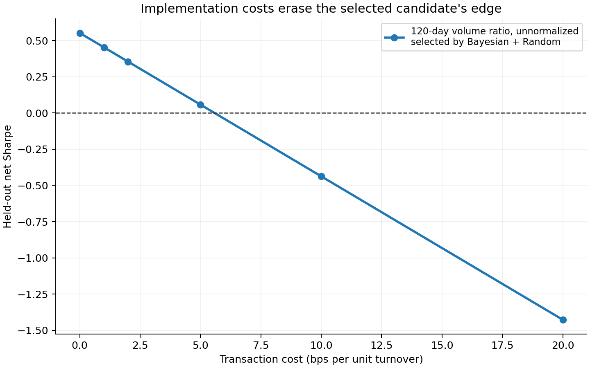
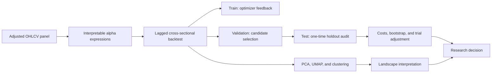

# Mapping the Optimization Landscape of Quantitative Alpha Discovery

[](https://github.com/James-Zhu1/alpha-optimization-landscape/actions/workflows/ci.yml)
[](pyproject.toml)
[](LICENSE)

> A quantitative research case study on a question that matters in practice: when an alpha search produces a strong backtest, is it a stable result or simply the best outcome from many noisy trials?

I built an end-to-end research system that generates interpretable cross-sectional equity signals, evaluates them under a common backtest, records the full search trajectory, and maps the resulting parameter space with PCA, UMAP, and clustering. I then subjected the selected candidates to chronological holdout testing, transaction costs, block-bootstrap uncertainty, and a multiple-testing adjustment.

The main result is intentionally sober: the best candidate retained a **0.553 gross Sharpe** on the untouched test period, but fell to **0.058 net Sharpe at 5 bps per unit turnover**. Its 95% moving-block bootstrap interval was **[-0.425, 1.498]**. I would not treat this as a defensible trading edge.

That rejection is the point of the project. It demonstrates a research process designed to challenge an attractive result rather than promote it.

**Every number above is checkable without running anything.** All 700 evaluations, the holdout audit, and the forward test are committed under [`results/`](results/) as Parquet, so a reader can verify the published figures directly:

```python
import pandas as pd
pd.read_parquet("results/out_of_sample_results.parquet")[["test_sharpe", "test_net_sharpe"]]
```

## Project at a glance

| Item | Scope or result |
|---|---|
| Research universe | Fixed 100-name U.S. large-cap snapshot |
| Sample | 2,889 trading days, January 2015–June 2026 |
| Prediction target | Cross-sectional 5-day forward return |
| Signal families | Momentum, mean reversion, volatility, volume ratio, moving-average crossover |
| Search | 500 random + 200 Bayesian evaluations |
| Model-development design | Chronological 60% train / 20% validation / 20% test, with purged split boundaries |
| Selected expression | Unnormalized 120-day volume ratio, selected independently by both optimizers |
| Held-out result | 0.553 gross Sharpe; 0.058 net Sharpe at 5 bps/unit turnover |
| Research decision | Reject evidence of a statistically and economically reliable edge |
| Continuing audit | Rerunnable forward test on post-study data, reported with explicit power limits |



Both optimizers selected the same expression, so the chart intentionally shows one shared cost curve rather than presenting duplicate evidence. The strategy's estimated break-even implementation cost was only **5.58 bps per unit turnover**, which makes the gross result economically fragile.

## What I wanted to learn

Most alpha-search projects show only the winning specification. I wanted to study the search process itself:

1. Do high-performing candidates occupy one concentrated part of the search space or several structurally different regions?
2. How much of the apparent geometry is created by realized performance rather than by the signal definitions?
3. Do random and Bayesian search explore the same regions?
4. Does the validation-selected result survive a test period that was not used for search or selection?
5. Does any remaining performance survive realistic frictions and repeated-trial adjustment?

The project therefore treats every evaluated expression as data. Each candidate is encoded by its signal family, parameters, normalization choice, and backtest diagnostics; the collection becomes an optimization landscape.



## Research design

### Signal and portfolio construction

Each expression combines one of five economically interpretable primitives with a discrete lookback and optional volatility normalization. On each date, the signal is converted to cross-sectional rank z-scores and scaled to unit gross exposure. The design emphasizes comparison across candidates rather than leverage.

A signal observed at the close of day `t` is shifted before trading. Its first matched outcome begins on `t+1`, preventing same-day lookahead. Synthetic tests deliberately compare the correct engine with a leaked version and verify perfect-foresight direction, turnover, drawdown, cost deduction, and bootstrap stability.

### Selection discipline

The timeline is split chronologically:

- **Training (60%)** supplies the Bayesian optimizer's objective.
- **Validation (20%)** ranks candidates and selects one winner per optimizer.
- **Test (20%)** is touched once, after selection.

Forward-return observations that would cross a split boundary are removed. Transaction-cost sensitivity is evaluated only after the candidate is fixed, so the test window is not quietly reused as another selection stage.

### Statistical and economic checks

Because 5-day returns overlap, adjacent observations are dependent. I use `252 / horizon` annualization and report a circular moving-block bootstrap interval rather than relying only on an independent-observation Sharpe interpretation.

The holdout audit also includes:

- gross and net Sharpe over a 0–20 bps cost sweep;
- turnover, information coefficient, Sortino ratio, and maximum drawdown;
- skewness and kurtosis of portfolio returns;
- a probabilistic/deflated Sharpe check against the expected best outcome from the logged trial count.

## What the results say

The search landscape was noisy but not structureless.

- The top decile of validation results was more concentrated than the full candidate population.
- After removing every performance metric from the feature representation, top-decile candidates still occupied **3 of 5 expression-only clusters**. This reduces the risk that the observed structure is merely a circular consequence of embedding Sharpe alongside the expression parameters.
- Random and Bayesian search selected the same slow, unnormalized 120-day volume-ratio expression. This is genuine convergence in this discrete experiment, not two independent holdout results.
- The held-out gross Sharpe was positive, but the result was fragile to costs and uncertainty. The bootstrap interval included poor outcomes, and the trial-adjusted probability was below 50% for both optimizer-specific trial counts.

My decision would be to stop here rather than advance the signal toward production. The experiment found an interesting research lead, not validated alpha.

For the complete interpretation, see the [research report](REPORT.md). For interactive inspection, launch the Streamlit landscape explorer.

## Keeping the conclusion honest as time passes

The study's holdout ends at the configured `end_date`. Everything after that boundary is the only genuinely out-of-time evidence the selected expression can have: it did not exist when the signal was searched, chosen, or audited.

`python -m src.forward_test --refresh` stages that window in an isolated cache, rebuilds a panel with the study's own construction rules, and scores the frozen expression on post-boundary dates only. The study cache is never written to, so the published experiment stays reproducible no matter how often the audit runs. Nothing in the harness selects, tunes, or reranks — that is what keeps it an audit rather than a second experiment, and what stops it from becoming the multiple-testing failure the study exists to demonstrate.

The first window is deliberately reported as inconclusive:

| Forward window | Observations | Gross Sharpe | Net Sharpe | 95% interval |
|---|---:|---:|---:|---:|
| 2026-07-01 to 2026-09-15 | 49 | 0.442 | -0.062 | [-2.897, 3.207] |

Ten non-overlapping observations cannot support a Sharpe claim, so the harness computes that verdict itself rather than leaving a reader to infer it. Results carry their own power statement, and the window widens on every rerun. See [FORWARD_TEST.md](FORWARD_TEST.md).

## Skills demonstrated

- **Quantitative research design:** chronological selection protocol, purged boundaries, explicit timing assumptions, and honest holdout use.
- **Vectorized backtesting:** cross-sectional portfolio construction, forward-return alignment, IC, turnover, drawdown, and transaction-cost modeling.
- **Optimization:** reproducible random search and Optuna TPE search over the same discrete expression space, with duplicate pruning and crash-safe logging.
- **Statistical analysis:** moving-block bootstrap, probabilistic/deflated Sharpe diagnostics, and careful treatment of overlapping returns.
- **Unsupervised learning:** standardized mixed-feature encoding, PCA, UMAP, KMeans, agglomerative clustering, HDBSCAN, NMI, purity, and pairwise-distance analysis.
- **Research engineering:** typed Python modules, configuration validation, committed Parquet evidence, deterministic seeds, 21 tests, linting, strict static type checks, continuous integration, and an interactive dashboard.
- **Research judgment:** separating an attractive gross backtest from evidence strong enough to support a trading claim.

## Repository guide

| Path | What it shows |
|---|---|
| [`REPORT.md`](REPORT.md) | Findings, interpretation, limitations, and the research decision |
| [`FORWARD_TEST.md`](FORWARD_TEST.md) | Living audit of the frozen signal on data after the study window |
| [`src/backtest.py`](src/backtest.py) | Signal timing, unit-gross portfolio construction, metrics, costs, and bootstrap logic |
| [`src/search.py`](src/search.py) | Chronological splits, random/Bayesian search, selection, and one-time holdout audit |
| [`src/trajectory.py`](src/trajectory.py) | Candidate-expression encoding and feature standardization |
| [`src/landscape.py`](src/landscape.py) | PCA, UMAP, and three clustering methods |
| [`src/forward_test.py`](src/forward_test.py) | Rerunnable post-study audit with an explicit statistical-power verdict |
| [`src/report.py`](src/report.py) | Data-driven analysis, figures, and report generation |
| [`src/dashboard.py`](src/dashboard.py) | Interactive landscape, filters, search progress, and diagnostics |
| [`results/`](results/) | Committed Parquet evidence: every evaluation, the holdout audit, and the forward test |
| [`tests/`](tests/) | Synthetic checks for the research assumptions most likely to create false alpha |
| [`notebooks/01_explore_trajectories.ipynb`](notebooks/01_explore_trajectories.ipynb) | Short reader-oriented walkthrough of the saved search artifacts |

## Limitations

This study uses a fixed present-day large-cap universe, which creates survivorship bias. It does not model delistings, borrow availability, market impact, capacity, or all corporate-action edge cases. Because the engine evaluates daily overlapping 5-day portfolios rather than explicit overlapping sleeves, turnover, costs, and drawdown are research diagnostics rather than a production P&L simulation. The optimizer comparison is descriptive because the budgets differ and only one seed was run. Finally, the deflated-Sharpe benchmark treats logged trials as independent; it is a transparent correction, not a precise estimate of the effective number of tests.

These constraints limit the trading claim, but they do not undermine the project's main purpose: demonstrating how I structure, test, and communicate a quantitative research problem.

## Optional local run

The saved report and figures are the primary portfolio artifacts; rerunning the project is optional.

```bash
python -m venv .venv
source .venv/bin/activate
python -m pip install -e '.[test]'

python -m src.data_pipeline all
python -m pytest
python -m src.search random
python -m src.search bayesian
python -m src.search combine
python -m src.search holdout --trajectory results/trajectory_combined.parquet
python -m src.report --trajectory results/trajectory_combined.parquet
streamlit run streamlit_app.py

# Audit the frozen winner on data published after the study window.
python -m src.forward_test --refresh
```

Configuration lives in [`config.yaml`](config.yaml). Generated data and trajectory files are intentionally excluded from version control; the report contains the portfolio-level evidence and conclusions.
