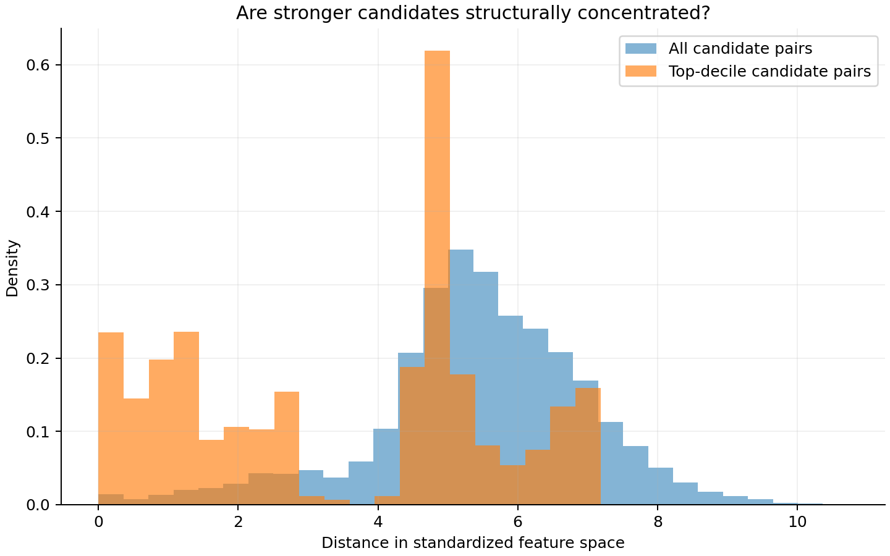
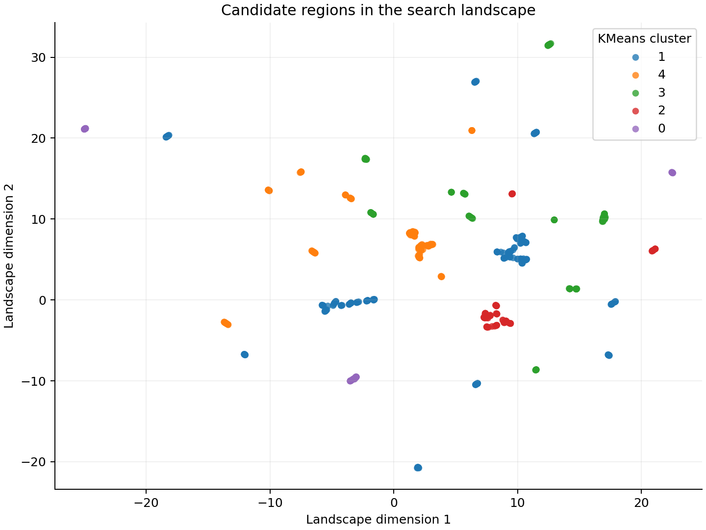
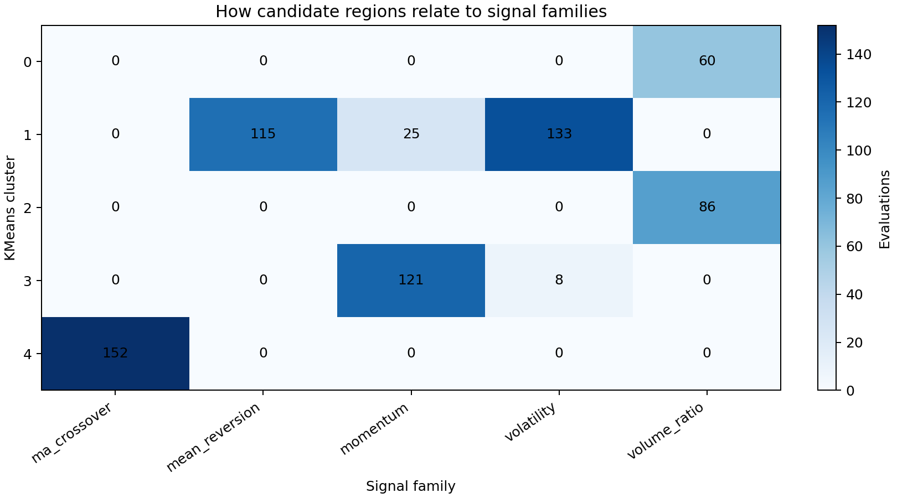
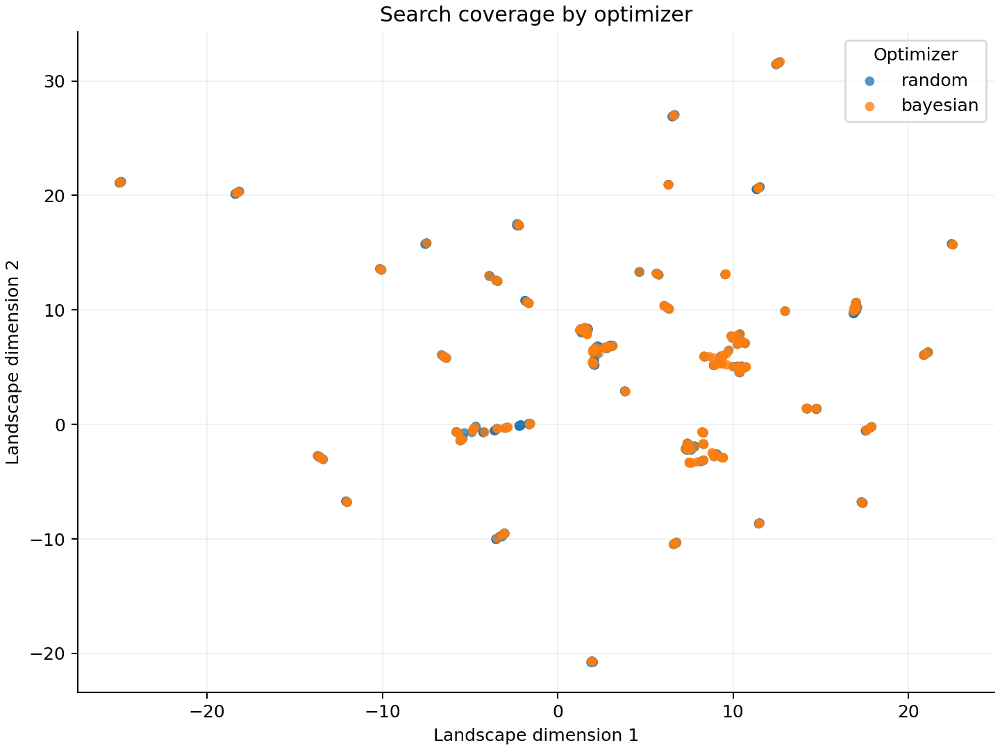
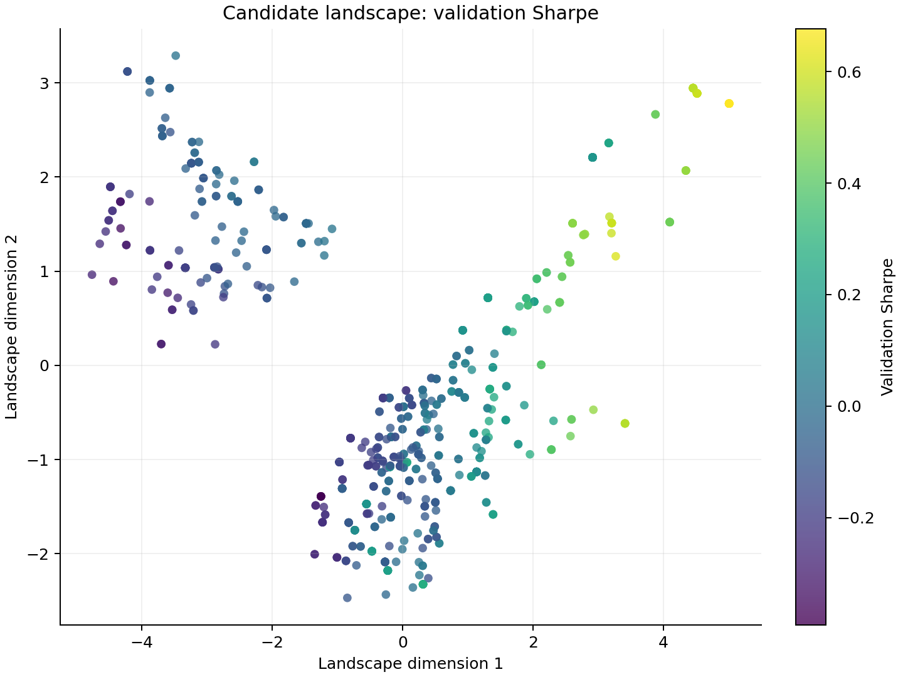
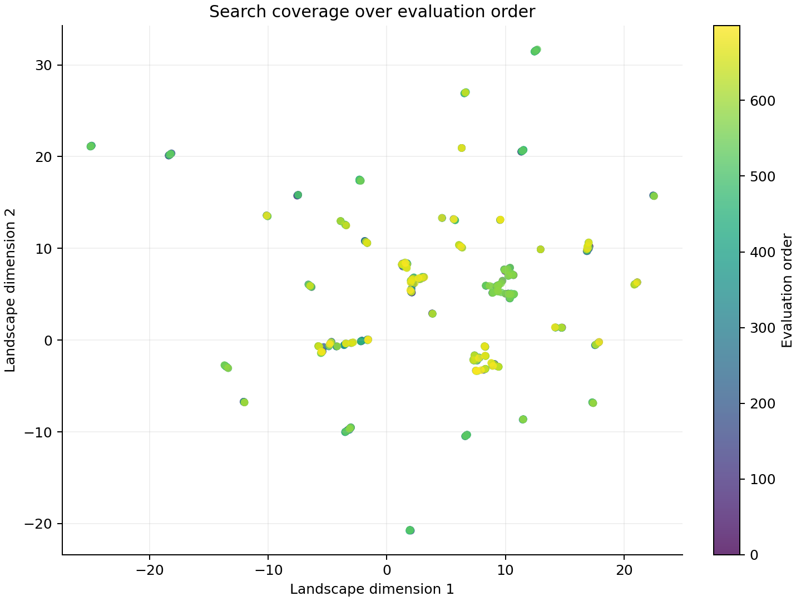

# Alpha Search Under Honest Validation

> Quantitative research portfolio report

## Executive summary

I investigated whether automated search over interpretable equity signals reveals stable high-performing regions or mainly selects the best result from noise. I evaluated **700 candidates** across five signal families, preserved every trial, mapped the search geometry, and subjected validation-selected winners to a one-time holdout audit.

The selected candidate produced **0.553 gross test Sharpe**, but only **0.058 net Sharpe at 5.0 bps per unit turnover**, with a **95% bootstrap interval of [-0.425, 1.498]**. **Decision: do not claim a reliable trading edge.**

This is the central judgment of the project: an attractive backtest is a research lead, not evidence, until it survives timing controls, honest selection, costs, uncertainty, and multiple testing.

## 1. Question and experimental design

The experiment uses 100 U.S. large-cap equities across 2,889 trading days (2015-01-02 to 2026-06-30), using a 5-day forward-return target. Candidate expressions combine momentum, mean reversion, volatility, volume ratio, or moving-average crossover with discrete lookbacks and optional volatility normalization.

| Stage | Role in the experiment | Protection against false discovery |
|---|---|---|
| Train (60%) | Supplies Bayesian optimizer feedback; random search remains unguided | Test data cannot guide search |
| Validation (20%) | Selects one winner per optimizer | Separates fitting from model choice |
| Test (20%) | One-time audit of fixed winners | Prevents repeated holdout shopping |

Signals observed at the close of day `t` first receive a return beginning on `t+1`. Forward-return windows that cross a split boundary are purged. Portfolios use cross-sectional rank z-scores scaled to unit gross exposure, which makes candidates comparable without introducing leverage differences.

## 2. What the landscape shows

The top-decile validation cutoff was **0.425 Sharpe**. Mean pairwise distance was **5.448** across all candidate pairs and **3.469** among top-decile pairs. The stronger candidates were therefore more concentrated in the standardized full-feature space.

To test whether performance metrics created that conclusion by construction, I rebuilt the representation using expression fields only. Mean distance was **4.270** for all expression pairs and **2.897** among the top decile. Top candidates occupied **3 of 5 expression-only clusters**.

**Interpretation:** the landscape is noisy but not structureless. Stronger validation results show concentration, and some structure remains after removing realized performance. This is evidence about the geometry of this experiment—not proof of mathematical local optima or future returns.

## 3. Signal families and candidate regions

KMeans clusters and signal families have **normalized mutual information 0.777** and **purity 0.789**. Full-feature and expression-only cluster assignments have **NMI 0.777**. These diagnostics quantify how much candidate geometry follows the primitive definitions and how much changes when realized outcomes enter the representation.

UMAP coordinates are synthetic neighborhood coordinates; their absolute values have no financial interpretation. Cluster counts are operational summaries that depend on feature scaling and the requested number of groups.

## 4. Search behavior

- **Bayesian search:** 200 evaluations; mean validation Sharpe 0.022, median -0.042, best 0.678.
- **Random search:** 500 evaluations; mean validation Sharpe 0.059, median -0.007, best 0.678.

This comparison is descriptive, not a horse race: the budgets differ (500 random versus 200 Bayesian evaluations) and only one seed was run.

## 5. Holdout audit: does the winner survive?

The highest-validation-Sharpe candidate from each optimizer was fixed before the test period was examined. The table reports the same cost assumption configured for the study.

| Optimizer | Selected expression | Validation Sharpe | Test gross Sharpe | Test net Sharpe | Trial-adjusted probability | 95% bootstrap interval |
|---|---|---:|---:|---:|---:|---:|
| Bayesian | 120-day volume ratio, unnormalized | 0.678 | 0.553 | 0.058 | 42.3% | [-0.425, 1.498] |
| Random | 120-day volume ratio, unnormalized | 0.678 | 0.553 | 0.058 | 21.4% | [-0.425, 1.498] |

Both optimizers independently selected the same expression. The identical test rows therefore represent one candidate reached by two search procedures, not two independent confirmations.

At **5.0 bps per unit turnover**, gross Sharpe declined from **0.553** to **0.058**. The interpolated break-even cost was only **5.58 bps**. The 95% circular moving-block bootstrap interval, **[-0.425, 1.498]**, spans economically weak outcomes. The trial-adjusted probability asks whether test Sharpe exceeds an expected best-of-N benchmark based on each optimizer's logged trial count; it remains below 50% in this run.

## 6. Research decision

**I would not advance this candidate as validated alpha.** It remains an interesting hypothesis—the optimizer convergence and slow volume signal merit economic investigation—but the current evidence is too fragile after implementation costs, dependence-aware uncertainty, and repeated-trial adjustment.

This negative decision is a substantive output of the analysis. The research process prevented a positive gross backtest from becoming an overstated trading claim.

## 7. Limitations and next research steps

- The fixed present-day large-cap universe introduces survivorship bias.
- Five-day targets overlap, so adjacent portfolio observations are dependent; annualization alone does not restore independence.
- Daily overlapping 5-day portfolios are not implemented as explicit overlapping sleeves, so turnover, costs, and drawdown are research diagnostics rather than a production P&L simulation.
- The linear transaction-cost model omits capacity, market impact, borrow availability, and execution dynamics.
- The optimizer comparison uses unequal budgets and one seed, so it is descriptive.
- The expected-best-Sharpe benchmark treats trial count as independent and is a transparent approximation, not an effective-trials estimator.

If the hypothesis were continued, I would first obtain point-in-time constituent data, add sector and beta neutralization, test subperiod and universe stability, model liquidity-dependent costs, and repeat optimizer comparisons over matched budgets and multiple seeds. Those steps come before expanding the signal library.

## 8. Implementation evidence

- Vectorized and explicitly lagged cross-sectional backtest
- Typed, configurable search over a fixed expression grammar
- Crash-safe Parquet logging of every evaluation
- PCA, UMAP, KMeans, agglomerative clustering, and HDBSCAN
- Dependence-aware bootstrap, trial-adjusted Sharpe, and transaction-cost sweep
- Synthetic tests for leakage, perfect-foresight direction, turnover, drawdown, costs, split purging, and holdout selection
- Streamlit explorer for candidate-level inspection

## Additional views

